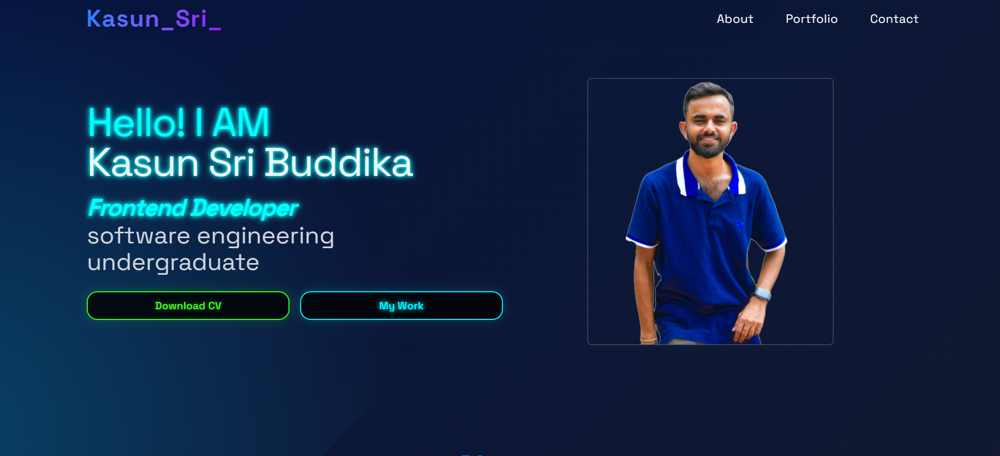

# Kasun Sri Buddika - Portfolio Website

A modern developer portfolio website showcasing projects, skills, and contact information. Features smooth animations, responsive design, and interactive elements.

## Key Features
- 🚀 Responsive navigation bar with smooth scrolling
- 💫 Animated sections using Framer Motion
- 🎨 Gradient-based UI design with Tailwind CSS
- 📱 Mobile-first responsive layout
- 📁 Project showcase with interactive cards
- 📧 Functional contact form
- 🌈 Modern glassmorphism effects
- 🔥 Tech stack icons with hover animations

## Technologies Used
- **Frontend**: React.js
- **Styling**: Tailwind CSS
- **Animations**: Framer Motion
- **Icons**: React Icons
- **Typing Effect**: React Type Animation
- **Smooth Scroll**: React Scroll
# Portfolio
 
